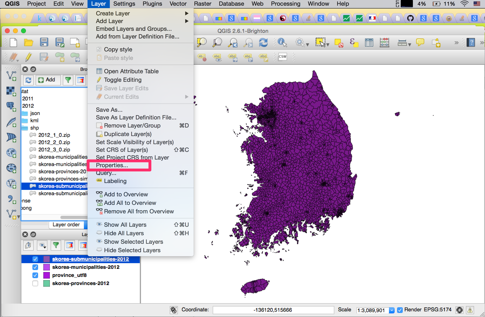
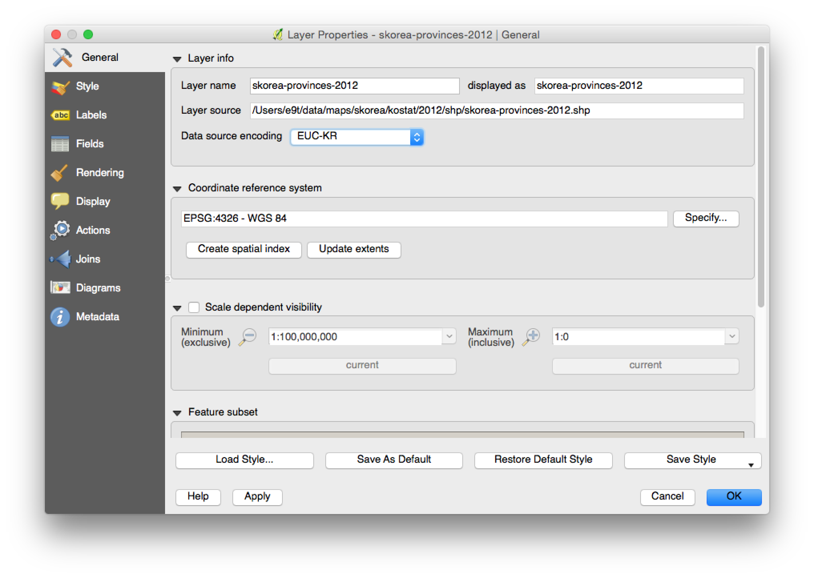
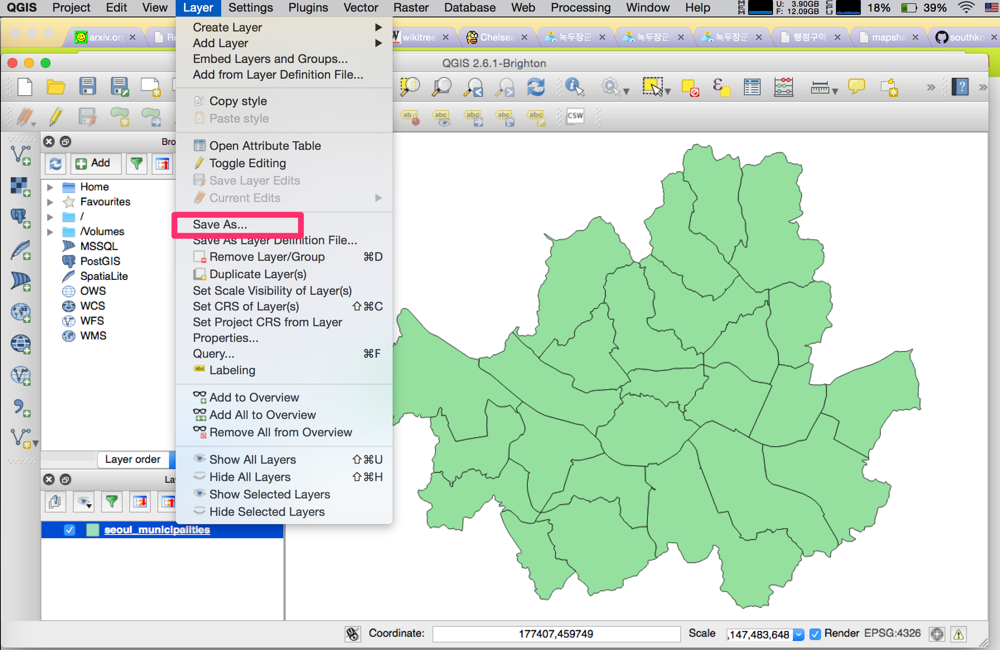
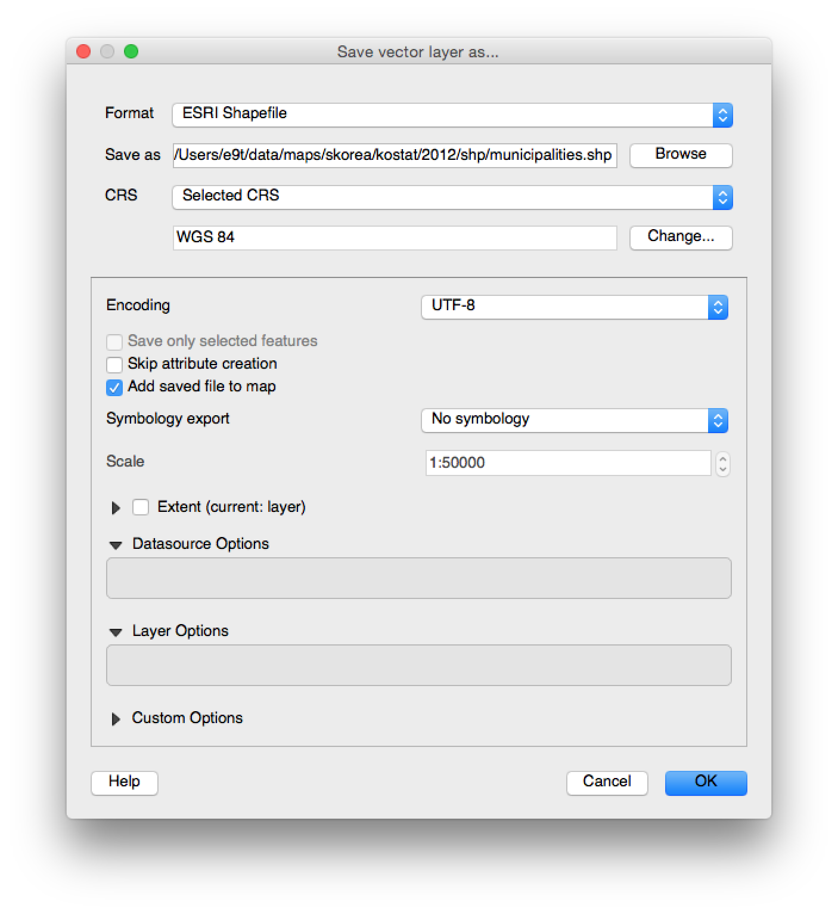
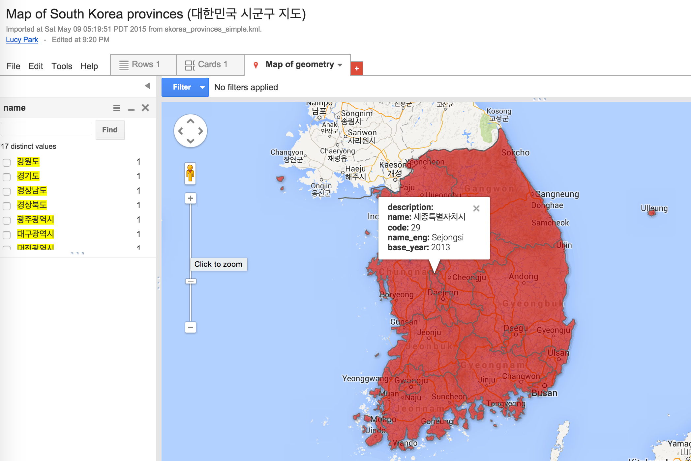
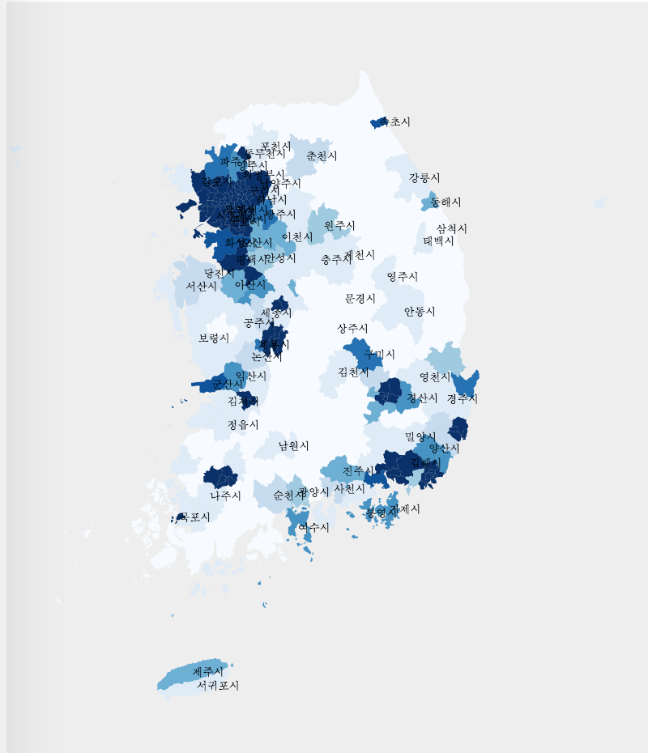
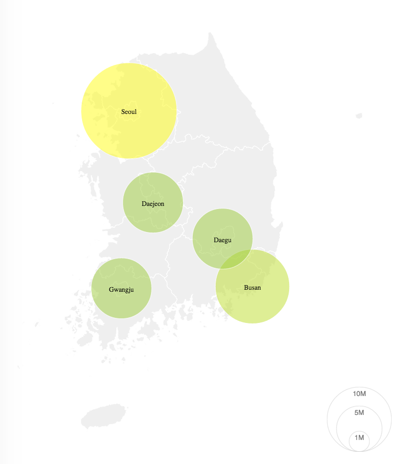
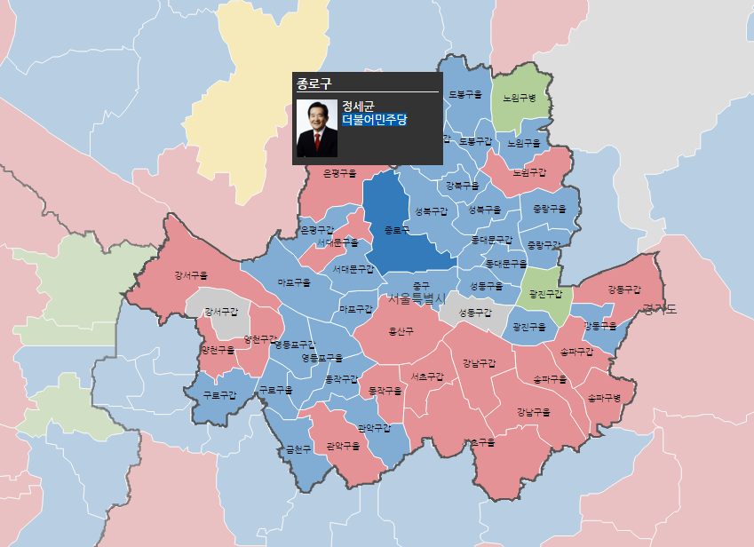

South Korea Maps
================

This repo hosts South Korea administrative division geodata in open formats that can be used to build static and interactive maps (e.g. with [D3](http://d3js.org)), and was inspired by [swiss-maps](https://github.com/interactivethings/swiss-maps).

To see maps for Seoul, go to https://github.com/southkorea/seoul-maps

## Description
### Formats
The following formats are available: 
[`shp`](http://en.wikipedia.org/wiki/Shapefile),
[`kml/kmz`](http://en.wikipedia.org/wiki/Keyhole_Markup_Language),
[`svg`](http://en.wikipedia.org/wiki/Scalable_Vector_Graphics), 
[`GeoJSON`](http://geojson.org),
[`TopoJSON`](http://github.com/mbostock/topojson), 
and `RData`.

### Sources 
Data is acquired from the following sources:

- [KOSTAT](http://kostat.go.kr): [Administrative division geodata for Census (센서스용 행정구역경계), 2011|2012}2013](http://sgis.kostat.go.kr/statbd/statbd_03.vw)
- [GADM](http://www.gadm.org): [Global administrative areas](http://www.gadm.org/country)
- [POPONG](http://popong.com): National Assembly Precinct (선거구), Hand-traced (for production)
- [Wikimedia](http://wikimedia.org): [Administrative divisions map of South Korea](http://commons.wikimedia.org/wiki/File:Administrative_divisions_map_of_South_Korea.svg)

### Levels
South Korean administrative divisions are consisted of three levels:

- [Provinces (시도)](http://en.wikipedia.org/wiki/Administrative_divisions_of_South_Korea#Provincial_level_divisions): Special City(특별시), Metropolitan City(광역시), Province(도), Special Self-governing Province(특별자치도), Special Self-governing City(특별자치시)
- [Municipalities (시군구)](http://en.wikipedia.org/wiki/Administrative_divisions_of_South_Korea#Municipal_level_divisions): Si (시, city), Gun (군, county), Gu (구, district)
- [Submunicipalities (읍면동)](http://en.wikipedia.org/wiki/Administrative_divisions_of_South_Korea#Submunicipal_level_divisions): Eup (읍, town), Myeon (면, township), Dong (동, neighborhood), Ri (리, village)
- Precinct (선거구): 19, 20대 국회 지역구

### Data
The following data are available.<br>
Numbers are data sizes in Megabytes in the following order: Country border, Provinces, Municipalities, Submunicipalities.
Numbers in parentheses are simplified versions of each format.

<table>
<thead>
    <tr>
        <th>Format \ Source</th>
        <th>KOSTAT (2013)</th>
        <th>GADM</th>
        <th>POPONG</th>
        <th>Wikimedia</th>
    </tr>
</thead>
<tbody>
    <tr>
        <td>ESRI Shapefile</td>
        <td>0, 9.6, 19, 46</td>
        <td>5.5, 5.5, 5.8, 0</td>
        <td>0</td>
        <td>0</td>
    </tr>
    <tr>
        <td>KML/KMZ</td>
        <td>0, 0.16, 0.452, 2.8</td>
        <td>1.5, 1.5, 1.7, 0</td>
        <td>0</td>
        <td>0</td>
    </tr>
    <tr>
        <td>SVG</td>
        <td>0</td>
        <td>0</td>
        <td>0, 0.014, 0, 0</td>
        <td>0, 0, 0.100, 0</td>
    </tr>
    <tr>
        <td>GeoJSON</td>
        <td>0, 31, 52, 0<br>(0, 0.148, 0.364, 1.7)</td>
        <td>15, 15, 16, 0</td>
        <td>0</td>
        <td>0</td>
    </tr>
    <tr>
        <td>TopoJSON</td>
        <td>0, 1.2, 2.0, 4.9<br>(0, 0.032, 0.0.96, 0.812)</td>
        <td>1.5, 1.5, 1.6, 0</td>
        <td>0</td>
        <td>0</td>
    </tr>
    <tr>
        <td>RData</td>
        <td>0</td>
        <td>1.0, 1.0, 1.2, 0</td>
        <td>0</td>
        <td>0</td>
    </tr>
</tbody>
</table>


## Development Notes

### Requirements

    brew install gdal
    npm install -g topojson

### KOSTAT (2013)
1. [Download Shapefiles](http://sgis.kostat.go.kr/statbd/statbd_03.vw)
    - Projection files are provided [here](http://sgis.kostat.go.kr/contents/support/support_01_closeup.jsp?sgis_board_seq=344&code=N). Otherwise, copy the snippet below and save to a separate `prj` file having the same name as the `shp` file.

            PROJCS["Bessel_1841_Transverse_Mercator",GEOGCS["GCS_Bessel_1841",DATUM["D_Bessel_1841",SPHEROID["Bessel_1841",6377397.155,299.1528128]],PRIMEM["Greenwich",0.0],UNIT["Degree",0.0174532925199433]],PROJECTION["Transverse_Mercator"],PARAMETER["False_Easting",200000.0],PARAMETER["False_Northing",500000.0],PARAMETER["Central_Meridian",127.0028902777778],PARAMETER["Scale_Factor",1.0],PARAMETER["Latitude_Of_Origin",38.0],UNIT["Meter",1.0]]
        - CRS: Korean 1985 / Modified Central, EPSG:5174
        - Data encoding: EUC-KR
    - Downloaded dates

        - 2011 version: Downloaded on Mar 2013.
        - 2012 version: Downloaded on Feb 2015.
        - 2013 version: Downloaded on May 2015.

1. Download and install [QGIS](http://qgis.org). With QGIS for each shapefile:
    1. Change layer encoding to EUC-KR<br>
        
        
    2. `Save as`, with CRS and data encoding as shown in the image below.<br>
        
        

        - Change [CRS](http://en.wikipedia.org/wiki/Coordinate_reference_system) from [Korean 1985 / Modified Central, EPSG:5174](http://epsg.io/5174) to [WGS84, EPSG:4326](http://epsg.io/4326)
        - Change data encoding from System to UTF8

1. Convert `shp` to GeoJSON, TopoJSON

        ogr2ogr -f geojson [geojson_file] [shp_file]
        topojson -p -o [topojson_file] [geojson_file]

1. Simplify `GeoJSON`s with http://mapshaper.org/ (with Visvalingam / weighted area, 1% simplification)

1. Convert simplifies `GeoJSON`s to `KML`

        ogr2ogr -f kml [simplified_geojson_file] [kml_file]

### GADM
#### Shapefile, KMZ, RData
To download data files, run:

    make get_gadm

#### GeoJSON
Created from shapefiles with `ogr2ogr -f geojson [filename]-geo.json [filename].shp`.

#### TopoJSON
Created from GeoJSON files with `topojson [filename]-geo.json -o [filename]-topo.json --properties`.

### Wikimedia
#### SVG
To download file, run:

    wget http://upload.wikimedia.org/wikipedia/commons/7/77/Administrative_divisions_map_of_South_Korea.svg


### POPONG
#### Precinct
1. Get a precinct raw table file (국회의원지역선거구구역표) and store it as text file like `popong/precinct/precianct_table_20.txt`.
2. The next step is to create a mapping from each municipality/submunicipality in the table to a code in the kostat map file.

        cd popong/precinct
        python create_mapping_precinct_to_map.py

    - But, if you do not have an up-to-date map file (e.g., the most recent one was created in 2013), you need to define exception cases (e.g., submunicipality can be renamed or splitted) on the `mismatch_case_precinct_map.py` file before you run the `create_mapping_precinct_to_map.py` file.
    - Once the code is successfully run, a geojson file containing a list of submunicipalities, each with the corresponding precinct will be created.
3. We can now create a precinct map by merging submunicipalities into precincts using mapshaper or similar tools.

        mapshaper merge_ready_submunicipalities_into_precinct_20.json -dissolve precinct_no copy-fields=precinct_name,province -o assembly-precinct-20-geo.json

    - You might want to create TopoJSON from GeoJSON
    - To make the size of data smaller and make boundaries prettier, you can simplify it. The simplified versions in this repository were created by creating the simplified version of submunicipality file before we run `create_mapping_precinct_to_map.py` file.
```
        topojson -p --simplify-proportion 0.4 -o submunicipalities-topo-simplified.json submunicipalities-topo.json
```

## Examples
- [대한민국 시군구 지도](https://www.google.com/fusiontables/DataSource?docid=1feTg5bOzs23Y3OxTeyu5QWMK0FaABm_ow9e7Pdni#map:id=3) ([KOSTAT KML, 2013](https://github.com/southkorea/southkorea-maps/blob/master/kostat/2013/kml/skorea_provinces_simple.kml))<br>
- [우리나라 시군구별 인구밀도 시각화](http://bl.ocks.org/e9t/55699e9fa8c3eb7fe40c) ([KOSTAT TopoJSON, 2012](https://github.com/southkorea/southkorea-maps/blob/master/kostat/2012/json/municipalities-topo-simple.json))<br>
- [우리나라 도시별 인구수 시각화](http://bl.ocks.org/e9t/826b20ae75b331f56b4e) ([KOSTAT TopoJSON, 2012](https://github.com/southkorea/southkorea-maps/blob/master/kostat/2012/json/provinces-topo-simple.json))<br>
- [19대 국회 지역구 지도](http://bl.ocks.org/minsukkahng/79c06b46ae545d1fbdf6297bd283b7d3) (POPONG TopoJSON)<br>
- [20대 국회 지역구 지도](http://bl.ocks.org/minsukkahng/6d9c3609e042592ec0f2f4edf8cd9103) (POPONG TopoJSON)
- [시도 시각화](http://bl.ocks.org/e9t/5712545) ([POPONG SVG](https://github.com/southkorea/southkorea-maps/blob/master/popong/skorea-provinces-v3.1.svg))
- [시도 시각화](http://bl.ocks.org/e9t/5409484) ([GADM TopoJSON](https://github.com/southkorea/southkorea-maps/blob/master/gadm/json/skorea-provinces-topo.json))
- [시군구 시각화](http://bl.ocks.org/e9t/5409518) ([GADM TopoJSON](https://github.com/southkorea/southkorea-maps/blob/master/gadm/json/skorea-municipalities-topo.json))
- ...add yours to this list!

## Copyright and License
### Contributors
- Lucy Park ([Team POPONG](/teampopong))
- [Justin Meyers](mailto:justinelliotmeyers@gmail.com)

### License
- KOSTAT: Free to share or remix.
- GADM:  For non-commercial purposes only. Redistribution not allowed.
- POPONG: <a rel="license" href="http://creativecommons.org/licenses/by/4.0/"></a>
- Wikimedia: [GNU 1.2+](http://commons.wikimedia.org/wiki/File:Administrative_divisions_map_of_South_Korea.svg#Licensing)

